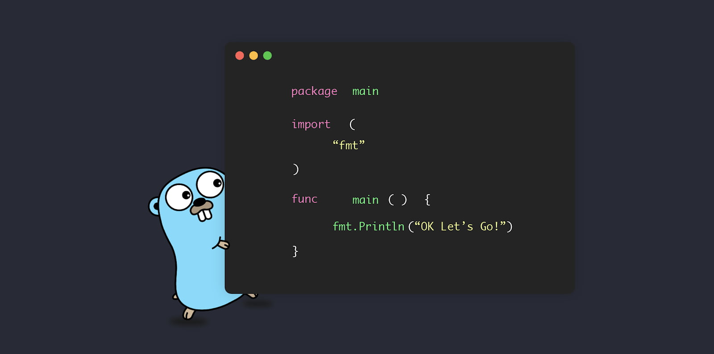

# Basic knowledge of the language

<h1 align="center"></h1>

All data that is stored in memory is essentially just a collection of bits.
And it is the data type that determines how this data will be interpreted and what operations can be performed on it.
Go is a statically typed language, meaning that all data used in a program has a specific type.

Go has a number of built-in data types and also allows you to define your own types.
### Data types:
- [String](https://github.com/lumorow/golang-interview-preparation/tree/main/Basic/string)
- [Map](https://github.com/lumorow/golang-interview-preparation/tree/main/Basic/map)
- [Slice](https://github.com/lumorow/golang-interview-preparation/tree/main/Basic/slice)
- [Interface](https://github.com/lumorow/golang-interview-preparation/tree/main/Basic/interface)

## README.md
***

- eng [English](https://github.com/lumorow/golang-interview-preparation/blob/main/Basic/README.md)
- ru [Русский](https://github.com/lumorow/golang-interview-preparation/blob/main/Basic/readme/README.ru.md)