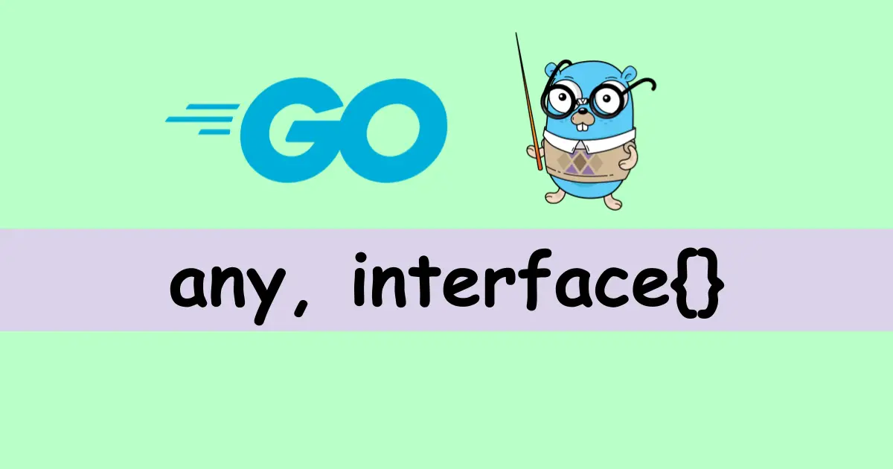

## Интерфейсы в GO

<h1 align="center"></h1>

Интерфейс в языке `Go` является следующей структурой:
```golang
// https://golang.org/src/runtime/runtime2.go

type iface struct {
    tab  *itab
    data unsafe.Pointer
}
```
В поле `tab` у нас хранится информация о конкретном типе объекта, который был преобразован в интерфейс. А в поле `data` - ссылка на реальную область памяти,
в которой лежат данные изначального объекта.

Интерфейс реализует тот объект, что определяет все методы, указанные в интерфейсе.

Пустой интерфейсный тип не описывает методы. У него нет правил. И поэтому любой объект удовлетворяет пустому интерфейсу.
Пустой интерфейсный тип `interface{}` — своего рода джокер. Если вы встретили его в объявлении
(переменной, параметра функции или поля структуры), то можете использовать объект любого типа.

## Преимущества применения интерфейсов

- Интерфейсы помогают уменьшить дублирование, то есть количество шаблонного кода.
- Они облегчают использование в модульных тестах заглушек вместо реальных объектов.
- Будучи архитектурным инструментом, интерфейсы помогают отвязывать части вашей кодовой базы.

## Тип объекта обернутого в интерфейс
Определить тип объекта обернутого в пустой интерфейс можно с помощью конструкции `switch`
```golang
func do(obj interface{}) {
    switch v := obj.(type) {
    case int:
        fmt.Printf("Twice %v is %v\n", v, v*2)
    case string:
        fmt.Printf("%q is %v bytes long\n", v, len(v))
    default:
        fmt.Printf("I don't know about type %T!\n", v)
    }
}
```
Также можно использовать библиотеку `reflect`. Когда пытаемся получить
настоящий исходный тип объекта интерфейса, reflect идёт в поле `tab` и получает информацию о типе там.
```golang
reflect.TypeOf(obj).String()
```
Преобразовать наш объект интерфейса обратно к исходному типу можно через синтаксис утверждений типа:
```golang
obj, ok := interfaceName.(structName)  
fmt.Printf("%#v\n", obj)
fmt.Printf("%t\n", ok)
```

Если сравнивать interface с `nil`, то будет `true`, пока мы не обернули в него объект. Даже если мы положим в `interface` пустой
указатель на объект, то interface уже не будет `nil`, так как одно из полей структуры будет указывать на тип объекта (`tab`)

## Дополнительный материал
***
- [Разбираемся с интерфейсами в Go (Блог компании VK)](https://habr.com/ru/companies/vk/articles/463063/)
- [Интерфейсы в Go — как красиво выстрелить себе в ногу](https://habr.com/ru/articles/597461/)
- [Тайные знания о GoLang, которые от вас скрывали (Николай Тузов — Golang)](https://www.youtube.com/watch?v=-cX0CqG6rgA&ab_channel=%D0%9D%D0%B8%D0%BA%D0%BE%D0%BB%D0%B0%D0%B9%D0%A2%D1%83%D0%B7%D0%BE%D0%B2%E2%80%94Golang)

## README.md
***

- eng [English](https://github.com/lumorow/golang-interview-preparation/blob/main/Basic/interface/README.md)
- ru [Русский](https://github.com/lumorow/golang-interview-preparation/blob/main/Basic/interface/README.ru.md)

