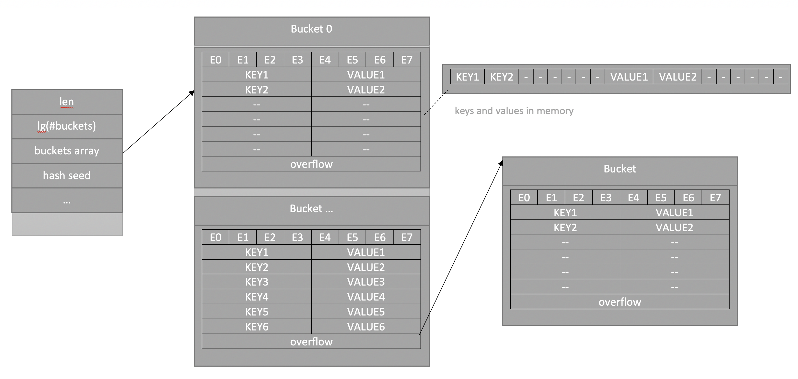

## Map in GO
***
<h1 align="center"></h1>

***

***

A hash table is a data structure that allows you to store key-value pairs, and typically has the following functions:

- Mapping: map(key) → value
- Insert: insert(map, key, value)
- Removal: delete(map, key)
- Search: lookup(key) → value

### Объявление
***
```golang
m := make(map[key_type]value_type)
```
```golang
m := new(map[key_type]value_type)
```
```golang
var m map[key_type]value_type // объявление, потом обязательно надо проинициализировать
```
```golang
m := map[key_type]value_type{key1: val1, key2: val2}
```

### Basic Operations
***
- Insert:
```golang
m[key] = value
```
- Removal:
```golang
delete(m, key)
```
- Search:
```golang
value = m[key]
value, ok = m[key]
```

### Traversing a table in go
***
A map in Go is `unordered`, that is, not ordered; when iterating through there will always be a different order of elements.
The search location is determined randomly (source language runtime code):

```golang
// mapiterinit initializes the hiter struct used for ranging over maps.
func mapiterinit(t *maptype, h *hmap, it *hiter) {...
// decide where to start
r := uintptr(fastrand())
...
it.startBucket = r & bucketMask(h.B)...}
```
Example:
```golang
package main

import "fmt"

func main() {
    m := map[int]bool{}
    for i := 0; i < 5; i++ {
        m[i] = ((i % 2) == 0)
    }
    for k, v := range m {
        fmt.Printf("key: %d, value: %t\n", k, v)
    }
}
```
Launch 1:

key: 3, value: false  
key: 4, value: true  
key: 0, value: true  
key: 1, value: false  
key: 2, value: true

Launch 2:

key: 4, value: true  
key: 0, value: true  
key: 1, value: false  
key: 2, value: true  
key: 3, value: false

### Go table lookup
Thanks to `«multiple assignment»` we can use the second variable `ok` to check the presence of a key in the map.
If there is no key, `null value of type` and `false` will be returned.
***
```golang
package main

import (
"fmt"
)

func main() {
    m := map[int]int{0: 50, 1: -100}
    m2, ok := m[2]
	m3 := m[3]
    if !ok {
        m2 = 20
    }
    fmt.Println(m, m[0], m[1], m2, m3) // map[0:0 1:10] 0 10 20 0
}
```

### Map element address
***
```golang
package main

import (
"fmt"
)

func main() {
    m := make(map[int]int)
    m[1] = 10
    a := &m[1]
    fmt.Println(m[1], *a)
}
```
`Go` says: `"cannot take the address of m[1]"`. Due to data evacuation, map growth. The item can be moved to a new bucket and the address will be
already point to the removed element.

### Definition
***
A map in Go is simply a pointer to an hmap structure. This is the answer to the question why, given that the map is passed to the function by
value, the values themselves that lie in it change - it’s all about the pointer. The hmap structure also contains the following: quantity
elements, the number of “buckets” (represented as a logarithm to speed up calculations), seed for hash randomization (to make it more difficult
ddosit - try to select the keys so that there will be continuous collisions), all sorts of service fields and, most importantly, a pointer to buckets,
where the values are stored.

```golang
// A header for a Go map.
type hmap struct {
    // Note: the format of the hmap is also encoded in cmd/compile/internal/gc/reflect.go.
    // Make sure this stays in sync with the compiler's definition.
    count     int // # live cells == size of map.  Must be first (used by len() builtin)
    flags     uint8
    B         uint8  // log_2 of # of buckets (can hold up to loadFactor * 2^B items)
    noverflow uint16 // approximate number of overflow buckets; see incrnoverflow for details
    hash0     uint32 // hash seed
    // buckets    unsafe.Pointer // array of 2^B Buckets. may be nil if count==0.
    oldbuckets unsafe.Pointer // previous bucket array of half the size, non-nil only when growing
    nevacuate  uintptr        // progress counter for evacuation (buckets less than this have been evacuated)
}
```


The picture shows a schematic representation of the structure in memory - there is a hmap header, the pointer to which is map in Go
(it is created when declared using var, but is not initialized, which is why the program crashes when trying
inserts). The buckets field is a storage of key-value pairs, there are several such “buckets”, each containing 8 pairs.
First, the “bucket” contains slots for additional hash bits (e0..e7 is called e - because extra hash bits).
Next are the keys and values, first a list of all keys, then a list of all values.

The hash function determines which “bucket” we put the value into; inside each “bucket” there can be up to 8 collisions;
at the end of each “bucket” there is a pointer to an additional one, if the previous one suddenly overflowed.

### How does map grow?
***
In the source code you can find the line:

> // Maximum average load of a bucket that triggers growth is 6.5.

that is, if each “bucket” has on average more than 6.5 elements, the buckets array increases.
In this case, an array 2 times larger is allocated, and the old data is copied into it in small portions every insertion
or removal so as not to create very large delays. Therefore, all operations will be a little slower in the process
evacuation of data (during search too, we have to search in two places). After a successful evacuation they begin
use new data.

## Resources
***
- [Go maps in action](https://go.dev/blog/maps)
- [Знакомство с картами в Go](https://www.digitalocean.com/community/tutorials/understanding-maps-in-go-ru)
- [Хэш таблицы в Go. Детали реализации](https://habr.com/ru/articles/457728/)
- [Как на самом деле устроен тип Map в Golang? (Николай Тузов — Golang)](https://www.youtube.com/watch?v=P_SXTUiA-9Y&ab_channel=%D0%9D%D0%B8%D0%BA%D0%BE%D0%BB%D0%B0%D0%B9%D0%A2%D1%83%D0%B7%D0%BE%D0%B2%E2%80%94Golang)

## README.md
***

- eng [English](https://github.com/lumorow/golang-interview-preparation/blob/main/Basic/map/README.md)
- ru [Русский](https://github.com/lumorow/golang-interview-preparation/blob/main/Basic/map/README.ru.md)