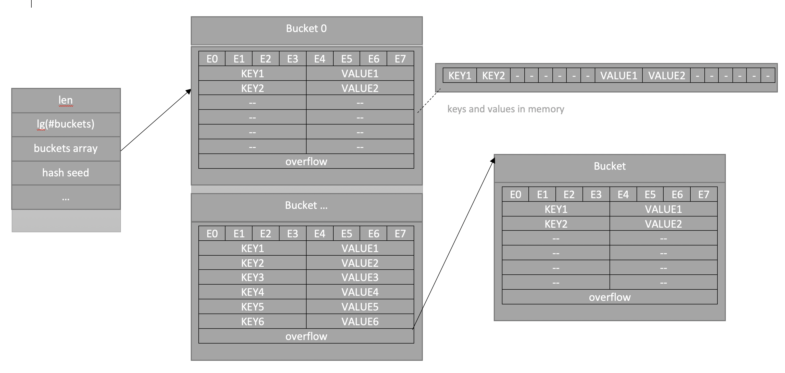

## Карты в GO

<h1 align="center"></h1>

Хэш таблица - это структура данных, которая позволяет хранить пары ключ-значение, и, как правило, обладающая функциями:

- Маппинга: map(key) → value
- Вставки: insert(map, key, value)
- Удаления: delete(map, key)
- Поиска: lookup(key) → value

### Объявление
***
```golang
m := make(map[key_type]value_type)
```
```golang
m := new(map[key_type]value_type)
```
```golang
var m map[key_type]value_type // объявление, потом обязательно надо проинициализировать
```
```golang
m := map[key_type]value_type{key1: val1, key2: val2}
```

### Основные операции
***
- Вставка:
```golang
m[key] = value
```
- Удаление:
```golang
delete(m, key)
```
- Поиск:
```golang
value = m[key]
value, ok = m[key]
```

### Обход таблицы в go
***
Мапа в Go `unordered`, то есть не упорядоченная, при переборе будет всегда разный порядок элементов.  
Место поиска определяется рандомно (исходник кода рантайма языка):
```golang
// mapiterinit initializes the hiter struct used for ranging over maps.
func mapiterinit(t *maptype, h *hmap, it *hiter) {...
// decide where to start
r := uintptr(fastrand())
...
it.startBucket = r & bucketMask(h.B)...}
```
Пример:
```golang
package main

import "fmt"

func main() {
    m := map[int]bool{}
    for i := 0; i < 5; i++ {
        m[i] = ((i % 2) == 0)
    }
    for k, v := range m {
        fmt.Printf("key: %d, value: %t\n", k, v)
    }
}
```
Запуск 1:

key: 3, value: false  
key: 4, value: true  
key: 0, value: true  
key: 1, value: false  
key: 2, value: true  

Запуск 2:

key: 4, value: true  
key: 0, value: true  
key: 1, value: false  
key: 2, value: true  
key: 3, value: false  

### Поиск в таблице Go
Благодаря `«multiple assignment»` мы можем проверять с помощью второй переменной `ok` наличие ключа в мапе.  
При отсутствии ключа будет возвращаться `«нулевое значение типа»` и `false`.
***
```golang
package main

import (
"fmt"
)

func main() {
    m := map[int]int{0: 50, 1: -100}
    m2, ok := m[2]
	m3 := m[3]
    if !ok {
        m2 = 20
    }
    fmt.Println(m, m[0], m[1], m2, m3) // map[0:0 1:10] 0 10 20 0
}
```

### Адрес элемента map
***
```golang
package main

import (
"fmt"
)

func main() {
    m := make(map[int]int)
    m[1] = 10
    a := &m[1]
    fmt.Println(m[1], *a)
}
```
`Go` говорит: `«cannot take the address of m[1]»`. Из - за эвакуации данных, роста мапы. Элемент может перенестись в новый бакет, и адрес будет
уже указывать на удаленный элемент.

### Определение
***
Мапа в Go — это просто указатель на структуру hmap. Это и является ответом на вопрос, почему при том, что мапа передается в функцию по
значению, сами значения, лежащие в ней меняются — все дело в указателе. Так же структура hmap содержит в себе следующее: количество
элементов, количество «ведер» (представлено в виде логарифма для ускорения вычислений), seed для рандомизации хэшей (чтобы было сложнее
заddosить — попытаться подобрать ключи так, что будут сплошные коллизии), всякие служебные поля и главное указатель на buckets,
где хранятся значения.
```golang
// A header for a Go map.
type hmap struct {
    // Note: the format of the hmap is also encoded in cmd/compile/internal/gc/reflect.go.
    // Make sure this stays in sync with the compiler's definition.
    count     int // # live cells == size of map.  Must be first (used by len() builtin)
    flags     uint8
    B         uint8  // log_2 of # of buckets (can hold up to loadFactor * 2^B items)
    noverflow uint16 // approximate number of overflow buckets; see incrnoverflow for details
    hash0     uint32 // hash seed
    // buckets    unsafe.Pointer // array of 2^B Buckets. may be nil if count==0.
    oldbuckets unsafe.Pointer // previous bucket array of half the size, non-nil only when growing
    nevacuate  uintptr        // progress counter for evacuation (buckets less than this have been evacuated)
}
```


На картинке схематичное изображение структуры в памяти — есть хэдер hmap, указатель на который и есть map в Go
(именно он создается при объявлении с помощью var, но не инициализируется, из-за чего падает программа при попытке
вставки). Поле buckets — хранилище пар ключ-значение, таких «ведер» несколько, в каждом лежит 8 пар.
Сначала в «ведре» лежат слоты для дополнительных битов хэшей (e0..e7 названо e — потому что extra hash bits).
Далее лежат ключи и значения как сначала список всех ключей, потом список всех значений.

По хэш функции определяется в какое «ведро» мы кладем значение, внутри каждого «ведра» может лежать до 8 коллизий, в конце каждого «ведра» есть указатель на дополнительное, если вдруг предыдущее переполнилось.

### Как растет map?
***
В исходном коде можно найти строчку:

> // Maximum average load of a bucket that triggers growth is 6.5.

то есть, если в каждом «ведре» в среднем более 6,5 элементов, происходит увеличение массива buckets.
При этом выделяется массив в 2 раза больше, а старые данные копируются в него маленькими порциями каждые вставку
или удаление, чтобы не создавать очень крупные задержки. Поэтому все операции будут чуть медленнее в процессе
эвакуации данных (при поиске тоже, нам же приходится искать в двух местах). После успешной эвакуации начинают
использоваться новые данные.

## Дополнительный материал
***
- [Go maps in action](https://go.dev/blog/maps)
- [Знакомство с картами в Go](https://www.digitalocean.com/community/tutorials/understanding-maps-in-go-ru)
- [Хэш таблицы в Go. Детали реализации](https://habr.com/ru/articles/457728/)
- [Как на самом деле устроен тип Map в Golang? (Николай Тузов — Golang)](https://www.youtube.com/watch?v=P_SXTUiA-9Y&ab_channel=%D0%9D%D0%B8%D0%BA%D0%BE%D0%BB%D0%B0%D0%B9%D0%A2%D1%83%D0%B7%D0%BE%D0%B2%E2%80%94Golang)

## README.md
***

- eng [English](https://github.com/lumorow/golang-interview-preparation/blob/main/Basic/map/README.md)
- ru [Русский](https://github.com/lumorow/golang-interview-preparation/blob/main/Basic/map/readme/README.ru.md)