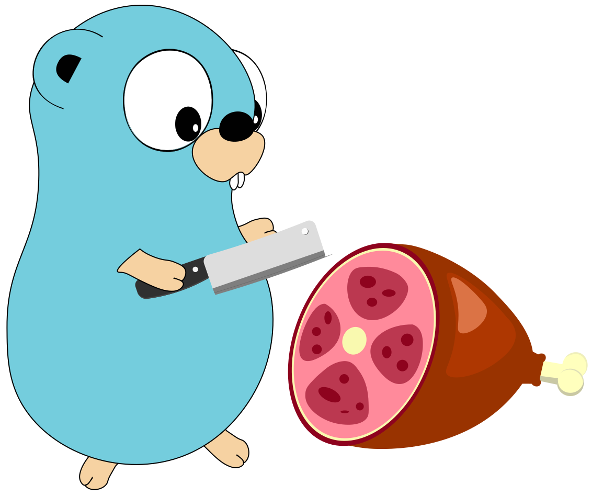

## Slice in Go

Slices are a structure that we will talk about next.
<h1 align="center"></h1>

### Declaration
***
- First option
```golang
planets := []string{
    "Mercury",
    "Venus",
    "Earth",
    "Mars",
    "Jupiter",
    "Saturn",
    "Uranus",
    "Neptune",
}
```

- Second option
```golang
planets := make([]string, len, cap) // make
```

- Third option
```golang
nums := [...]int{
1,
2,
3,
4,
5,
6,
}

numsSl := nums[:] // composite literal, declare a slice from an array
```
### Definition
***
The difference between a slice and an array is as follows:

- A slice is a reference to an array;
- A slice can dynamically allocate memory and change its size;
- A slice is represented by the following structure in the `GO` sources

```golang
type slice struct {
    array unsafe.Pointer
    len   int
    cap   int
}
```
`len (length)` — current cut length, `cap` (capacity) — length of the internal array.

Both of these options can be specified when calling the make function:
```golang
sl := make(
[]int,
10, // len
10, // cap
)
```
`cap` — a key parameter for memory allocation that affects the performance of inserting into a slice.

### Let's consider the behavior of a slice as its size increases.
***
```golang
a := []int{99}
b := a[0:1]
b[0] = 0

fmt.Println(a)
// [0]

a[0] = 99

fmt.Println(b)
// [99]
```

We got slice `b` from slice `a`. Next we see that changes in one slice affect the other. Both slices refer to the same array.
Now let's complete the example by inserting elements into slice `a`:
Let's consider the behavior of a slice as its size increases.
```golang
a := []int{99}
b := a[0:1]

a = append(a, 100)
a[0] = 0

fmt.Println(a, b)
// [0 100] [99]
```
Now the values of the slice elements are different. Now the slices refer to a different array.

The `growslice` function from the source code is responsible for this.
Changing the `cap` of a slice will always copy the array data:
```golang
memmove(p, old.array, lenmem)
```
`cap` will change as follows
```golang
const threshold = 256
    if old.cap < threshold {
        newcap = doublecap
    } else {
        // Check 0 < newcap to detect overflow
        // and prevent an infinite loop.
        for 0 < newcap && newcap < cap {
        // Transition from growing 2x for small slices
        // to growing 1.25x for large slices. This formula
        // gives a smooth-ish transition between the two.
        newcap += (newcap + 3*threshold) / 4
	}
```

## Removing an element from a slice
***
To remove the `i` element from a slice, you need to select the elements before and after it,
and then combine the two new slices into one.
```golang
slice = append(slice[:i], slice[i+1:]...)
```

## Resources
***
- [Go Slices: usage and internals](https://go.dev/blog/slices-intro)
- [Arrays and Slices in Go](https://www.digitalocean.com/community/tutorials/understanding-arrays-and-slices-in-go)
- [GoLang Slice в деталях, простым языком (Николай Тузов — Golang)](https://www.youtube.com/watch?v=10LW7NROfOQ&ab_channel=%D0%9D%D0%B8%D0%BA%D0%BE%D0%BB%D0%B0%D0%B9%D0%A2%D1%83%D0%B7%D0%BE%D0%B2%E2%80%94Golang)

## README.md
***
- eng [English](https://github.com/lumorow/golang-interview-preparation/blob/main/Basic/slice/README.md)
- ru [Русский](https://github.com/lumorow/golang-interview-preparation/blob/main/Basic/slice/readme/README.ru.md)