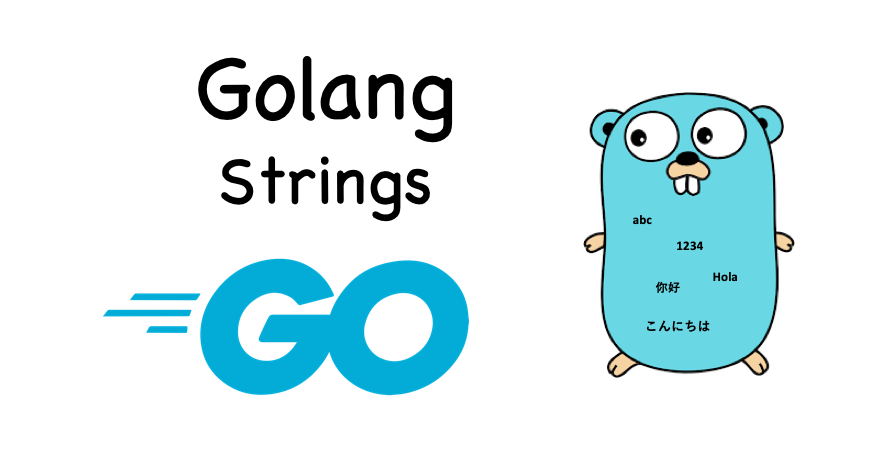

## String in GO

<h1 align="center"></h1>

`Strings` in `Go` are encoded in `UTF-8`, one of several standard Unicode encoding characters.
`UTF-8` is an efficient variable-length encoding. A single code can use 8, 16, or 32 bits of memory.
### Declaring Go string queries
***

```golang
str := "hello"
var str = "hello"
var str string = "hello"
```
If you declare a variable without specifying a value,
it will be initialized to zero.
The null value of type `string` is empty quotes (""):
```golang
var str string
```

### Is it possible to change strings in Golang?
***

Strings in `Golang` are not meant to be manipulated.
You can assign another string to a variable, but
the strings themselves cannot be edited:
```golang
str := "hello"
str = "home" // YES
str[0] = 'q' // NO
```

### Decoding strings into runes
***

- Strings use an encoding called `UTF-8`, where each character requires
  from 1 to 4 bytes;
- `byte` is another name for type `uint8`, and `rune` is another name
  type `int32`;
- The range keyword can decode a `UTF-8` encoded string into runs. 

### An efficient way to concatenate strings
***

```golang
func concat2builder(x, y string) string {
  var builder strings.Builder
  builder.Grow(len(x) + len(y)) // this line allocates memory
  builder.WriteString(x)
  builder.WriteString(y)
  return builder.String()
}
```

## README.md
***

- eng [English](https://github.com/lumorow/golang-interview-preparation/blob/main/Basic/string/README.md)
- ru [Русский](https://github.com/lumorow/golang-interview-preparation/blob/main/Basic/string/readme/README.ru.md)