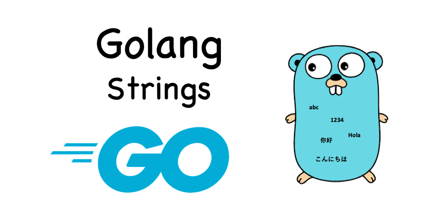

## Строки в GO

<h1 align="center"></h1>


`Строки` в Go закодированы в `UTF-8`, одном из нескольких стандартных символов кодирования юникод.
`UTF-8` является эффективным кодированием переменной длины. Один код может использовать память объемом 8, 16 или 32 бита.
### Объявление строк в GO
***

```golang
str := "hello"
var str = "hello"
var str string = "hello"
```
Если объявить переменную без указания значения,
оно будет инициализировано нулевым значением.  
Нулевое значение типа `string` представляет собой пустые кавычки (""):
```golang
var str string
```

### Можно ли менять строки в Golang?
***

Строки в `Golang` не предназначены для изменений.
Вы можете присвоить переменной другую строку, но
сами строки редактировать нельзя:
```golang
str := "hello"
str = "home" // Можно
str[0] = 'q' // Нельзя
```

### Перевод строк в руны
***

- Строки используют кодировку `UTF-8`, где каждый символ требует
  от 1 до 4 байт;
- `byte` является другим названием типа `uint8`, a `rune` является другим названием типа `int32`;
- Ключевое слово range может декодировать закодированную строку `UTF-8` в руны.

### Эффективный способ объединения строк
***

```golang
func concat2builder(x, y string) string {
  var builder strings.Builder
  builder.Grow(len(x) + len(y)) // выделение памяти
  builder.WriteString(x)
  builder.WriteString(y)
  return builder.String()
}
```

## README.md
***

- eng [English](https://github.com/lumorow/golang-interview-preparation/blob/main/Basic/string/README.md)
- ru [Русский](https://github.com/lumorow/golang-interview-preparation/blob/main/Basic/string/readme/README.ru.md)