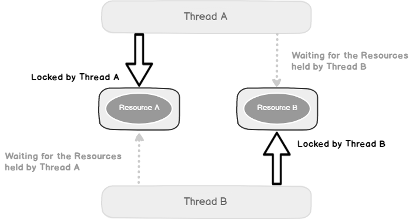
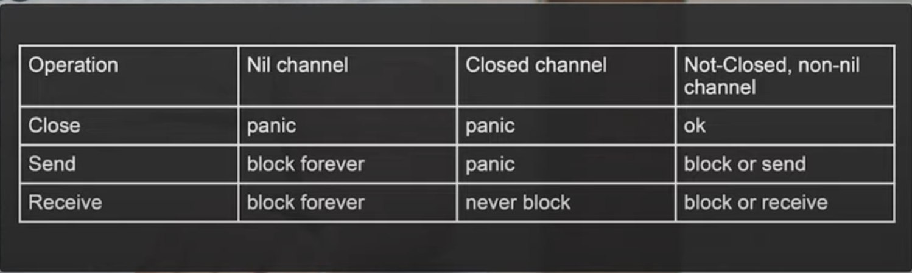

# Multithreading golang

<h1 align="center"></h1>

Executing more than one task at the same time is known as multithreading. Go is rich in functionality
for working with multithreading, in particular, tools such as goroutines and channels.

## Goroutines
***

Goroutines are “lightweight threads” and serve to potentially parallelize the work of a program.
A goroutine stack initially weighs only `2 KB` and can dynamically expand or shrink depending on needs.

Stack size, we can find it in `runtime/stack.go`:
```golang
// The minimum size of stack used by Go code
_StackMin = 2048
```
If there are several goroutines, then it is impossible to say exactly in what order they will
be executed, so the scheduler is responsible for this.

## Channel
***

Channels are used for communication and data transfer through goroutines and their synchronization.
A channel can be both reading and sending.
```golang
ch := make(chan type)
ch <- "hello" // Write to channel
tmp := <- ch // Read from the channel
close(ch) // Close the channel
```

With `make(chan type)` a structure with 10 fields is created, and 4 of them will be parsed.
```golang
type hchan struct {
	qcount   uint           // total data in the queue
	dataqsiz uint           // size of the circular queue
	buf      unsafe.Pointer // points to an array of dataqsiz elements
	elemsize uint16
	closed   uint32
	elemtype *_type // element type
	sendx    uint   // send index
	recvx    uint   // receive index
	recvq    waitq  // list of recv waiters
	sendq    waitq  // list of send waiters

	// lock protects all fields in hchan, as well as several
	// fields in sudogs blocked on this channel.
	//
	// Do not change another G's status while holding this lock
	// (in particular, do not ready a G), as this can deadlock
	// with stack shrinking.
	lock mutex
}
```

The first, `buf` - `Ring buffer` (`circle queue`), which stores our data.
Typically, the implementation of a circular queue is done on an array and on two pointers (indexes) in this array:
We constantly write and increment one index, and we read and increment the other index (`sendx` and `recvx`).
And when we reach the end, we simply move to the beginning. Here we have an array and two indexes,
on which we write and read. And there is also `lock`.
In the case when we have a full buffer and cannot write, a queue of goroutines begins to form.

### Unbuffered channels
***
Unbuffered channels can only transmit one piece of data at a time, with blocking.

When a goroutine (gopher) sends data to a channel, it blocks until another goroutine reads the data from the channel.
Similar to blocking when writing to a channel, a goroutine can block when reading from a channel until nothing is written to it.
```golang
ch := make(chan string)
```

### Buffered channels
***

We can send multiple pieces of data into a buffered channel without having to be read by another goroutine.
This is the main difference from unbuffered channels.
```golang
ch := make(chan string, 5)
```

## Reading from a channel
***
### - In a for-range loop

```golang
go func() {
    for data := range сh {
        fmt.Println(data)
    }
}()
```
Once all data from the channel has been processed, the loop will block on reading;
To avoid blocking, you need to close the channel by calling `close(ch)`.

### - Non-blocking read from channel
By using the `select-case` construct, blocking reading from the pipe can be avoided.
The goroutine will read data from the channel if it is there, otherwise the `default` block is executed:

```golang
func main() {
    myChan := make(chan string)
    
    go func() {
        myChan <- "Message!"
    }()
    
    select {
        case msg := <-myChan:
            fmt.Println(msg)
        default:
            fmt.Println("No Msg")
    }
    <-time.After(time.Second * 1)
    select {
        case msg := <-myChan:
            fmt.Println(msg)
        default:
            fmt.Println("No Msg")
    }
}
```

Once run, this code will output the following:
>No Msg  
Message!

## Recording in a channel
***
### - Non-blocking channel recording

```golang
select {
case myChan <- "message":
    fmt.Println("sent the message")
default:
    fmt.Println("no message sent")
}
```

## Synchronization
***
You can synchronize channels in the following ways (examples can be found in [mthreading.go](https://github.com/lumorow/golang-interview-preparation/blob/main/Multithreading/mthreading.go))
- WaitGroup
- Context
- Chan

## Deadlock

> fatal error: all goroutines are asleep - deadlock!

<h1 align="center"></h1>

Deadlock is a mistake
which occurs when processes have a cyclic dependence on a pair of synchronized objects.

Deadlock is a program in which all parallel processes wait for each other.
In this state, the program will never recover without outside intervention.

### Example
```golang
func main() {
    var wg sync.WaitGroup
    printSum := func(v1, v2 *value) {
    defer wg.Done()
    
          v1.mu.Lock() // Process 1 is blocking A; Process 2 is blocking B
          defer v1.mu.Unlock()
    
          time.Sleep(2 * time.Second)
    
          v2.mu.Lock() // Process 1 is waiting for B; Process 2 is waiting for A
          defer v2.mu.Unlock()
    
          fmt.Printf("sum=%v\n", v1.value+v2.value)
    }
    var a, b value
    wg.Add(2)
    go printSum(&a, &b) // Process 1
    go printSum(&b, &a) // Process 2
    wg.Wait()
}

type value struct {
    mu    sync.Mutex
    value int
}
```
> fatal error: all goroutines are asleep — deadlock!

Debugging deadlocks, like other synchronization errors, is complicated by the fact that
for their occurrence, specific conditions for the simultaneous execution of several processes are required.
If Process 1 had time to acquire resource B before Process 2, then the error would not have occurred.

## Race condition and Data Race

Race condition and data race are two different multithreading problems that are often confused. Let's try to figure it out.

### Race condition
Race condition is a flaw that occurs when the timing or order of events affects the correctness of the program.

Given that race condition is a semantic error, there is no general way that can distinguish the correct one
and incorrect program behavior in the general case.

### Data Race
Data race is a condition when different threads access the same memory cell without any synchronization
and at least one of the threads is writing.

Data Races have a precise definition that is not necessarily related to correctness, and are therefore discoverable.
There are many types of data race detectors (static/dynamic detection,
lock-based detection, antecedent-based detection, hybrid data race detection).

Go has a good [Data Race Detector](https://go.dev/doc/articles/race_detector) with which such
errors can be detected.

## It is important to know
<h1 align="center"></h1>

## Resources
- [Изучаем многопоточное программирование в Go по картинкам](https://habr.com/ru/articles/412715/)
- [Конкурентность в Go: пять примеров (МТС)](https://habr.com/ru/companies/ru_mts/articles/680324/)
- [Go: как изменяется размер стека горутины?](https://habr.com/ru/companies/otus/articles/586108/)
- [Go Channels Internals](https://habr.com/ru/companies/oleg-bunin/articles/522742/)
- [Как на самом деле устроены каналы в Golang? | Golang channels internals (Николай Тузов — Golang)](https://www.youtube.com/watch?v=ZTJcaP4G4JM&ab_channel=%D0%9D%D0%B8%D0%BA%D0%BE%D0%BB%D0%B0%D0%B9%D0%A2%D1%83%D0%B7%D0%BE%D0%B2%E2%80%94Golang)
- [Разбираемся с пакетом Context в Golang](https://habr.com/ru/companies/nixys/articles/461723/)

## README.md
***

- eng [English](https://github.com/lumorow/golang-interview-preparation/blob/main/Multithreading/README.md)
- ru [Русский](https://github.com/lumorow/golang-interview-preparation/blob/main/Multithreading/readme/README.ru.md)