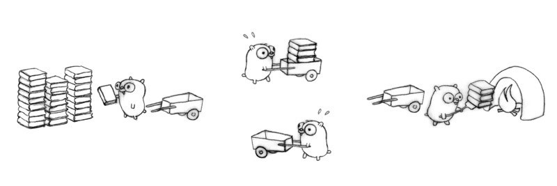
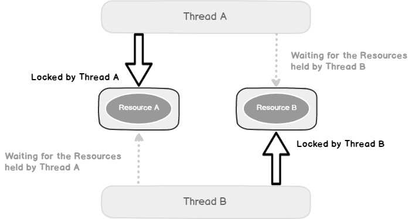
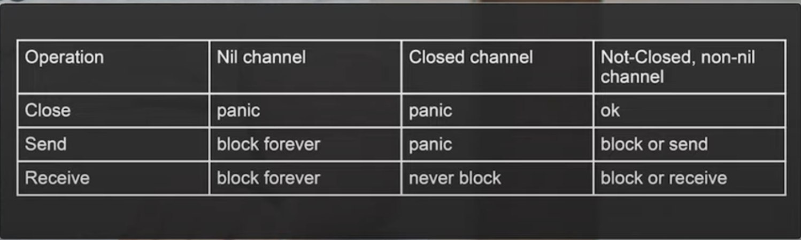

# Многопоточность в golang

<h1 align="center"></h1>

Одновременное выполнение более чем одной задачи известно как многопоточность. Go имеет богатую функциональность
для работы с многопоточностью, в частности, такие инструменты как горутины и каналы.

## Горутины
***

Горутины - это «легковесные потоки» и служат для потенциального распараллеливания работы программы.
Стек горутин изначально весит всего 2 КБ и может динамически расширяться или уменьшаться в зависимости от потребностей.

Размера стека, мы можем найти его в runtime/stack.go:
```golang
// The minimum size of stack used by Go code
_StackMin = 2048
```
Если есть несколько горутин, то невозможно сказать точно, в каком порядке они выполнятся, так за это отвечает планировщик.

## Каналы
***

Каналы служат для общения-передачи данных через горутины и их синхронизации.
Канал может быть и читающим, и отправляющим.
```golang
ch := make(chan type)
ch <- "hello" // Записать в канал
tmp := <- ch // Прочитать из канала
close(ch) // Закрыть канал.
```
При `make(chan type)` создается структура с 10 полями, и 4 из них разберем.
```golang
type hchan struct {
	qcount   uint           // total data in the queue
	dataqsiz uint           // size of the circular queue
	buf      unsafe.Pointer // points to an array of dataqsiz elements
	elemsize uint16
	closed   uint32
	elemtype *_type // element type
	sendx    uint   // send index
	recvx    uint   // receive index
	recvq    waitq  // list of recv waiters
	sendq    waitq  // list of send waiters

	// lock protects all fields in hchan, as well as several
	// fields in sudogs blocked on this channel.
	//
	// Do not change another G's status while holding this lock
	// (in particular, do not ready a G), as this can deadlock
	// with stack shrinking.
	lock mutex
}
```

Первое, `buf` — `Ring buffer` (`circle queue`, или кольцевая очередь), которое хранит наши данные.
Обычно имплементация кольцевой очереди делается на массиве и на двух указателях (индексах) в этом массиве:
один индекс мы постоянно пишем и инкрементируем, а другой индекс читаем и инкрементируем (`sendx` и `recvx`).
И когда мы достигаем конца, то просто перемещаемся в начало. Здесь же у нас есть массив и два индекса,
по которым пишем и читаем. И есть еще `lock`.  
В случае, когда у нас полный буфер и мы не можем писать, начинает выстраиваться очередь из горутин.

### Небуферизованные каналы
***
В небуферизованные каналы можно передать только один фрагмент данных за раз, с блокировкой.

Когда горутина (гофер) посылает данные в канал, она блокируется до тех пор, пока другая горутина не прочитает данные из канала.
Аналогично блокировке при записи в канал, горутина может быть заблокирована при чтении из канала до тех пор, пока в него ничего не запишут.
```golang
ch := make(chan string)
```

### Буферизованные каналы
***

В буферизоваванный канал мы можем послать несколько фрагментов данных, без необходимости чтения их другой горутиной.
Это основное отличие от небуферизованных каналов.
```golang
ch := make(chan string, 5)
```

## Чтение из канала
***
### - В цикле for-range

```golang
go func() {
    for data := range сh {
        fmt.Println(data)
    }
}()
```
Как все данные из канала обработаны, цикл заблокируется на чтении;
чтобы избежать блокировки, нужно закрыть канал вызовом `close(ch)`.

### - Неблокирующе чтение из канала
Используя конструкцию `select-case`, можно избежать блокирующего чтения из канала.
Горутина прочитает из канала данные, если только они там есть, в противном случае выполняется блок `default`:

```golang
func main() {
    myChan := make(chan string)
    
    go func() {
        myChan <- "Message!"
    }()
    
    select {
        case msg := <-myChan:
            fmt.Println(msg)
        default:
            fmt.Println("No Msg")
    }
    <-time.After(time.Second * 1)
    select {
        case msg := <-myChan:
            fmt.Println(msg)
        default:
            fmt.Println("No Msg")
    }
}
```
После запуска этот код выведет следующее:
>No Msg  
Message!

## Запись в канал
***
### - Неблокирующая запись в канал

```golang
select {
case myChan <- "message":
    fmt.Println("sent the message")
default:
    fmt.Println("no message sent")
}
```

## Синхронизация
***
Синхронизировать каналы можно следующими способами (примеры можно найти в [mthreading.go](https://github.com/lumorow/golang-interview-preparation/blob/main/Multithreading/mthreading.go))
- WaitGroup
- Context
- Chan

## Deadlock

> fatal error: all goroutines are asleep - deadlock!

<h1 align="center"></h1>

Deadlock или взаимная блокировка — это ошибка,
которая происходит когда процессы имеют циклическую зависимость от пары синхронизированных объектов.

Deadlock — это программа, в которой все параллельные процессы ожидают друг друга.
В этом состоянии программа никогда не восстановится без вмешательства извне.

### Пример
```golang
func main() {
    var wg sync.WaitGroup
    printSum := func(v1, v2 *value) {
    defer wg.Done()
    
          v1.mu.Lock() // Процесс 1 блокирует А; Процесс 2 блокирует B
          defer v1.mu.Unlock()
    
          time.Sleep(2 * time.Second)
    
          v2.mu.Lock() // Процесс 1 ожидает B; Процесс 2 ожидает А
          defer v2.mu.Unlock()
    
          fmt.Printf("sum=%v\n", v1.value+v2.value)
    }
    var a, b value
    wg.Add(2)
    go printSum(&a, &b) // Процесс 1
    go printSum(&b, &a) // Процесс 2
    wg.Wait()
}

type value struct {
    mu    sync.Mutex
    value int
}
```
> fatal error: all goroutines are asleep — deadlock!

Отладка взаимных блокировок, как и других ошибок синхронизации, усложняется тем,
что для их возникновения нужны специфические условия одновременного выполнения нескольких процессов.
Если бы Процесс 1 успел захватить ресурс B до Процесса 2, то ошибка не произошла бы.

## Race condition и Data Race

Race condition и data race — две разные проблемы многопоточности, которые часто путают. Попробуем разобраться.

### Race condition
Race condition — это недостаток, возникающий, когда время или порядок событий влияют на правильность программы.

Учитывая, что race condition семантическая ошибка, нет общего способа который может отличить правильное
и неправильное поведение программы в общем случае.

#### Data Race
Data race это состояние когда разные потоки обращаются к одной ячейке памяти без какой-либо синхронизации
и как минимум один из потоков осуществляет запись.

У Data Race есть точное определение, которое необязательно связано с корректностью, и поэтому их можно обнаружить.
Существует множество разновидностей детекторов гонки данных (статическое/динамическое обнаружение, обнаружение
на основе блокировок, обнаружение основанное на предшествующих событий, обнаружение гибридного data race).

У Go есть хороший [Data Race Detector](https://go.dev/doc/articles/race_detector) с помощью которого такие ошибки
можно обнаружить.

## Важно знать
<h1 align="center"></h1>

## Дополнительный материал
- [Изучаем многопоточное программирование в Go по картинкам](https://habr.com/ru/articles/412715/)
- [Конкурентность в Go: пять примеров (МТС)](https://habr.com/ru/companies/ru_mts/articles/680324/)
- [Go: как изменяется размер стека горутины?](https://habr.com/ru/companies/otus/articles/586108/)
- [Go Channels Internals](https://habr.com/ru/companies/oleg-bunin/articles/522742/)
- [Как на самом деле устроены каналы в Golang? | Golang channels internals (Николай Тузов — Golang)](https://www.youtube.com/watch?v=ZTJcaP4G4JM&ab_channel=%D0%9D%D0%B8%D0%BA%D0%BE%D0%BB%D0%B0%D0%B9%D0%A2%D1%83%D0%B7%D0%BE%D0%B2%E2%80%94Golang)
- [Разбираемся с пакетом Context в Golang](https://habr.com/ru/companies/nixys/articles/461723/)
- [Race condition и Data Race](https://medium.com/german-gorelkin/race-8936927dba20)

## README.md
***

- eng [English](https://github.com/lumorow/golang-interview-preparation/blob/main/Multithreading/README.md)
- ru [Русский](https://github.com/lumorow/golang-interview-preparation/blob/main/Multithreading/readme/README.ru.md)