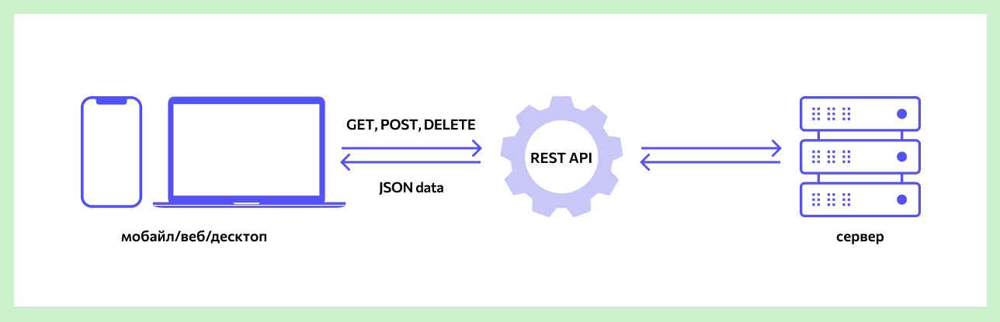

# Basic knowledge of networks

## REST API

REST API is a way for websites and web applications to interact with the server. It is also called RESTful "architectural style".

<h1 align="center"></h1>

API (Application Programming Interface) is code that allows two applications to exchange
data from the server.  

REST (Representational State Transfer) is a way of creating APIs using the HTTP protocol.

***
### REST API Principles
RESTful has 7 principles for coding interfaces.

- Separation of the client from the server (`Client-Server`).
  The client is the user interface of a site or application, for example, a video hosting search bar.
  In a REST API, the request code stays on the client side and the data access code stays on the server side.
  This simplifies the organization of the API and makes it easy to transfer the user interface to another platform
  and makes it possible to better scale server data storage.

- Lack of client state recording (`Stateless`). The server should not store state information
  (operations performed) of the client. Each request from the client must contain only the information
  which is needed to receive data from the server.

- Cacheable. The request data must indicate whether the data should be cached
  (save in a special buffer for frequent requests). If there is such an indication, the client will receive
  the right to access this buffer if necessary.

- `Uniform Interface`. All data must be requested through one URL
  standard protocols such as HTTP. This simplifies the architecture of the site or application and makes
  interaction with the server is clearer.

- Multi-level system (`Layered System`). In RESTful, servers can be located at different levels,
  Moreover, each server interacts only with the nearest levels and is not connected by requests with others.

- Providing code upon request (`Code on Demand`). Servers can send code to the client
  (for example, a script to start a video). This way, the overall code of an application or website becomes more complex only when necessary.

- `Starting with the Null Style`. The client knows only one entry point to the server.
  Further interaction opportunities are provided by the server.

***
### The REST API has 4 HTTP methods that are used to manipulate objects on servers:

- GET (receiving information about data or a list of objects)
- DELETE (deleting data)
- POST (adding or replacing data)
- PUT (regular data update)

Such requests are also called `CRUD` identifiers: create (create), read (read), update (update) delete (delete).
This is a standard set of actions for working with data.

## TCP and UDP. In which case is UDP preferable?
***
`TCP` is a transport protocol for data transfer in `TCP/IP` networks, which preliminarily establishes a connection to the network.
`UDP` is a transport protocol that transmits datagram messages without the need to establish a connection in the `IP` network.

The difference between the `TCP` and `UDP` protocols is the so-called “delivery guarantee”. `TCP` requires a response from the client,
to whom the data packet is delivered, confirmation of delivery, and for this it needs a pre-established connection.
Also, the `TCP` protocol is considered reliable, while `UDP` has even received the name “unreliable datagram protocol”.
`TCP` eliminates data loss, duplication and mixing of packets, and delays. `UDP` allows all this, and the connection
it doesn't need it to work. Processes to which data is sent via `UDP` must make do with what they receive,
even with losses. `TCP` controls the congestion of the connection, `UDP` does not control anything except the integrity of received
datagram.
On the other hand, thanks to such non-selectivity and lack of control, `UDP` delivers data packets (datagrams)
much faster, therefore for applications that are designed for high bandwidth and fast exchange,
`UDP` can be considered the optimal protocol. These include online and browser games, as well as viewing programs
streaming video and applications for video communication (or voice): the loss of a packet, complete or partial, does not change anything,
It is not necessary to repeat the request, but the download is much faster. The `TCP` protocol, as more reliable,
successfully used even in email programs, allowing you to control not only traffic, but also the length of the message
and traffic exchange speed.

## What is NAT?
***
Networks are usually designed using private `IP` addresses.
These addresses are `10.0.0.0/8`, `172.16.0.0/12` and `192.168.0.0/16`. These private addresses are used within an organization or site,
to allow devices to communicate locally and not be routed over the internet. To allow the device to
private `IPv4` address to access devices and resources outside the local network, the private address must first
be transferred to a publicly accessible address.

And just `NAT` converts private addresses into public ones. This allows a device with a private `IPv4` address
access resources outside of his private network. `NAT` in combination with `IPv4` private addresses has proven useful
method of storing public `IPv4` addresses. One public `IPv4` address can be used by hundreds, even
thousands of devices, each with a private `IPv4` address. `NAT` has the added benefit of
in adding a degree of privacy and security to the network as it hides internal `IPv4` addresses from external ones
networks.

## What are HTTP and HTTPS, what are their differences?
***
`HTTP` (from the English HyperText Transfer Protocol - hypertext transfer protocol) is an application data transfer protocol
online. Currently used to obtain information from websites. The `HTTP` protocol is based on the use
“client-server” technologies: the client sending the request is the initiator of the connection; the server receiving the request
executes it and sends the result to the client.

`HTTPS` (from the English HyperText Transfer Protocol Secure - secure hypertext transfer protocol) is an extension
`HTTP` protocol, supporting encryption using `SSL` and `TLS` cryptographic protocols.
### What is the difference between HTTP and HTTPS:

`HTTPS` is not a separate data transfer protocol, but is an extension of the `HTTP` protocol with an encryption add-on;
data transmitted via the `HTTP` protocol is not protected, `HTTPS` ensures the confidentiality of information by encrypting it;
`HTTP` uses port 80, `HTTPS` uses port 443.

## What are SSL and TLS, are there any differences between them?
***
`SSL` or Secure Sockets Layer was the original name of the protocol developed by `Netscape`
in the mid-90s. SSL 1.0 was never publicly available, and version 2.0 had serious flaws.
The `SSL 3.0` protocol, released in 1996, was completely redesigned and set the tone for the next stage of development.

When the next version of the protocol was released in 1999, it was standardized by a special design working group
network of the Internet and gave it a new name: transport layer security, or `TLS`. As the `TLS` documentation says,
“the difference between this protocol and S`SL 3.0` is not critical.” `TLS` and `SSL` form a constantly updated series of protocols,
and they are often combined under the name `SSL`/`TLS`.
The `TLS` protocol encrypts Internet traffic of any kind. The most common type is web traffic. You know when your browser establishes a TLS connection -
if the link in the address bar starts with "https".
`TLS` is also used by other applications, such as mail and teleconferencing systems.
The most secure encryption method is asymmetric encryption. This requires 2 keys, 1 public and 1 private. These are files with information,
most often very large numbers. The mechanism is complex, but simply put, you can use a public key to encrypt data, but you need a private key to decrypt it.
The two keys are linked using a complex mathematical formula that is difficult to hack.
Because asymmetric encryption uses complex mathematical calculations, it requires a lot of computing resources. `TLS` solves this problem
by using asymmetric encryption only at the beginning of the session to encrypt communications between the server and client.
The server and client must agree on a single session key, which the two of them will use to encrypt data packets.

## OSI levels

OSI model - describes how network devices work. This is a data transfer process that is divided into 7 levels.

The process of data transfer always involves the sending device, the receiving device, as well as the data itself,
which must be sent and received. From the point of view of an ordinary user, the task is elementary - you need to take
and send this data. Everything that happens when sending and receiving data is described in detail by the seven-layer OSI model.
***
### L1, physical layer

This layer works with cables, contacts in connectors, signal modulation, coding of ones and zeros and others
low level things.
Essentially, the first level is the level of wires and physical methods of signal transmission. Minimal abstraction.

The most famous protocol at the physical layer is Ethernet. It describes how signals are encoded and transmitted over wires.
In addition, there is Bluetooth, Wi-Fi and an infrared port, which also contain instructions for transferring data.

Physical layer devices - hubs and repeaters. They work with the physical signal “stupidly” and do not delve into its logic: they received the data and transmitted it further along the wire.
***
### L2, data link layer

Above the physical layer is the channel layer. Its task is to check the integrity of the received data and correct errors.
This level is “smarter” than the previous one: it already understands that different voltage amplitudes correspond to different bits - zeros and
units. The channel layer can also encode signals into bits and transmit them further.

The data received from the lower level is divided into frames, or frames. Each frame consists of service information - for example,
sender and recipient addresses, as well as the data itself.

It turns out something like a postal envelope. On the front side it says who the letter came from, and inside
the letter itself is located (in our case, data).

The front side of the envelope is the MAC address of the device that sent us the information. It is needed to identify
devices on the local network, consists of 48 or 64 bits and looks something like this:

Another important fact about MAC addresses: when a laptop or smartphone is assembled at a factory, it is immediately assigned
a specific MAC address, which then cannot be changed in any way. The MAC address of desktop PCs is hardwired into the network card,
therefore, it can only be changed by replacing this very card.
***
### L3, network layer

This layer is responsible for routing data within the network between computers.
Terms such as “routers” and “IP addresses” already appear here.

Routers allow different networks to communicate with each other: they use MAC addresses to build
path from one device to another.

Data at the network layer is represented in the form of packets. Such packets are similar to frames from the link layer,
but use different recipient and sender addresses - IP addresses.

To obtain the IP address of both devices (sender and recipient), there is a protocol
ARP (address resolution protocol). It can convert MAC to IP address and vice versa.
***
### L4, transport layer

From the name it is clear that at this level data is transferred over the network. This is true.
The two main protocols here are TCP and UDP. They are precisely responsible for how exactly the data will be transmitted.
***
### L5, session layer

From this level and higher, the data already has a normal form - for example, the JPEG or MP3 files we are familiar with.
The task of the network at these levels is to present information in a form understandable to humans and to make it so
so that the user can somehow “touch” it.

The session layer manages connections, or sessions. A typical example is a Skype or Zoom call.
When you call another person, a connection is established between your computers,
through which audio and video are transmitted. If such a connection is interrupted, your call will be interrupted.

At the session level, it is very important that the connection is established and maintained correctly.
That is, protocol mechanisms must check that both interlocutors have the necessary codecs and
there is a signal between the devices.
***
### L6, presentation layer

At this level, data formats are converted - their encoding and compression.
For example, the received data can be turned into a GIF or MP4 file. The same thing happens
and in reverse order: when a user sends a file to another person, the data is first converted
into bits and compressed, and then transmitted to the transport layer.

In addition to encoding and compression at the presentation level, data can be encrypted - if necessary, of course.
***
### L7, application layer

The last layer of the OSI model is the application layer. It contains network services,
which help you surf the Internet without any problems.

The application layer is like a kind of graphical interface for the entire OSI model - with its
with the help of the user interacts with other levels without even knowing it. This interface is called the network interface.

The most popular network interfaces are HTTP, HTTPS, FTP and SMTP.
And the “devices” here are already programs: Zoom, Telegram, browsers.
***
## Resources

- [REST API](https://blog.skillfactory.ru/glossary/rest-api/)
- [How the Web Works: A Primer for Newcomers to Web Development (or anyone, really)](https://www.freecodecamp.org/news/how-the-web-works-a-primer-for-newcomers-to-web-development-or-anyone-really-b4584e63585c#.7l3tokoh1)
- [How the Web Works Part II: Client-Server Model & the Structure of a Web Application](https://medium.com/free-code-camp/how-the-web-works-part-ii-client-server-model-the-structure-of-a-web-application-735b4b6d76e3#.e6tmj8112)
- [HTTP 1, 2 and 3 — easy](https://habr.com/ru/articles/739166/)
- [HTTP/1.1 and HTTP/2](https://www.8host.com/blog/v-chem-raznica-mezhdu-http1-1-i-http2/#:~:text=%D0%92%20%D0%BE%D1%82%D0%BB%D0%B8%D1%87%D0%B8%D0%B5%20%D0%BE%D1%82%20HTTP%2F1.1%2C%20%D0%BA%D0%BE%D1%82%D0%BE%D1%80%D1%8B%D0%B9%20%D0%B4%D0%BE%D0%BB%D0%B6%D0%B5%D0%BD%20%D0%B8%D1%81%D0%BF%D0%BE%D0%BB%D1%8C%D0%B7%D0%BE%D0%B2%D0%B0%D1%82%D1%8C%20%D0%BD%D0%B5%D1%81%D0%BA%D0%BE%D0%BB%D1%8C%D0%BA%D0%BE%20%D1%81%D0%BE%D0%B5%D0%B4%D0%B8%D0%BD%D0%B5%D0%BD%D0%B8%D0%B9,%D0%B2%20%D0%BF%D1%80%D0%B8%D0%B2%D1%8B%D1%87%D0%BD%D0%BE%D0%BC%20%D1%84%D0%BE%D1%80%D0%BC%D0%B0%D1%82%D0%B5%20%D0%B7%D0%B0%D0%BF%D1%80%D0%BE%D1%81%2D%D0%BE%D1%82%D0%B2%D0%B5%D1%82.)
- [A Simple Guide to the OSI Networking Model for Beginners](https://selectel.ru/blog/osi-for-beginners/)
- [What is the OSI model and why is it needed: the dissecting layer cake of the Internet](https://skillbox.ru/media/code/chto-takoe-model-osi-i-zachem-ona-nuzhna-prepariruem-sloyenyy-pirog-interneta/)
- [Context packet in Go](https://habr.com/ru/companies/pt/articles/764850/)

## README.md

- eng [English](https://github.com/lumorow/golang-interview-preparation/blob/main/Networking/README.md)
- ru [Русский](https://github.com/lumorow/golang-interview-preparation/blob/main/Networking/readme/README.ru.md)