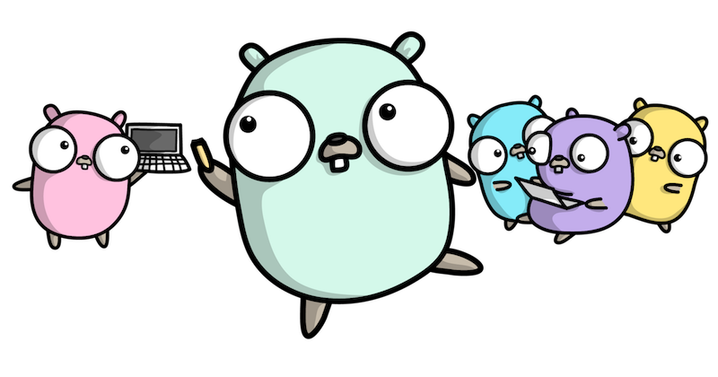

# Golang interview preparation
This page is dedicated to consolidating and, possibly,
new knowledge for you in the golang programming language.
This covers both theoretical and practical parts.  
The page will be gradually supplemented and edited.

## Topics:
- [Basic knowledge of the language](https://github.com/lumorow/golang-interview-preparation/tree/main/Basic): let's talk about data types and working with them.
- [Design Patterns](https://github.com/lumorow/golang-interview-preparation/tree/main/Patterns): design patterns and how they are implemented in golang.
- [Introduction to Object-oriented Programming in Go (OOP GO)](https://github.com/lumorow/golang-interview-preparation/tree/main/OOP): how object-oriented programming is and implemented in golang.
- [Multithreading](https://github.com/lumorow/golang-interview-preparation/tree/main/Multithreading): how do threads work in golang.
- [Networking](https://github.com/lumorow/golang-interview-preparation/tree/main/Networking): basic knowledge of networking.
- [Practical features of the language](https://github.com/lumorow/golang-interview-preparation/tree/main/Practical): interesting points in golang that you need to understand.
- [Golang under the hood](https://github.com/lumorow/golang-interview-preparation/tree/main/UnderHood): what happens while our program is running.

## Your first program:
How to Write Go Code https://go.dev/doc/code#Workspaces

## Helpful Learning Resources

#### RUS:
- [Avito.code](https://www.youtube.com/playlist?list=PLknJ4Vr6efQFHIBKN_igl7Zl6nMbcjrsd)
- [Уроки по GoLang. Николай Тузов — Golang](https://www.youtube.com/playlist?list=PLFAQFisfyqlXt2kAMc1L2NC9NgHPSQgvQ)
- [REST API](https://www.youtube.com/playlist?list=PLbTTxxr-hMmyFAvyn7DeOgNRN8BQdjFm8)
- [Всё про конкурентность в Go](https://www.youtube.com/watch?v=mvUiw9ilqn8)
- [Антон Сергеев, «Go под капотом»](https://www.youtube.com/watch?v=rloqQY9CT8I&t=7s)
- [Как устроен garbage collector в Go 1.9 - Андрей Дроздов, Avito](https://www.youtube.com/watch?v=CX4GSErFenI)
- Книга: Цукалос Михалис Golang для профи: работа с сетью, многопоточность, структуры данных и машинное обучение с Go

#### ENG:
- [All Design Patterns in Go (Golang)](https://golangbyexample.com/all-design-patterns-golang/)
- [Questions on Golang Basics](https://www.educative.io/blog/50-golang-interview-questions)
- [50 Top Golang Interview Questions and Answers for 2023](https://hackr.io/blog/golang-interview-questions-and-answers)