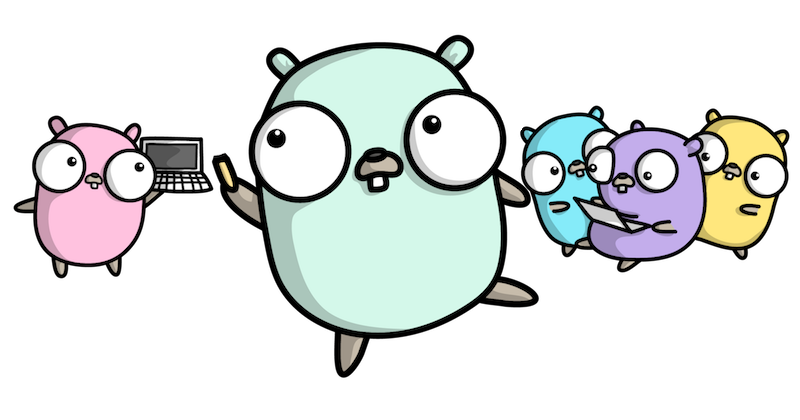

# Подготовка к собеседованию на Golang

Эта страница посвящена закреплению и, возможно, появлению
для вас новых знаний по языку программирования golang.
Это касается как теоретической, так и практической части.
Страница будет постепенно дополняться и редактироваться.

<h1 align="center"></h1>

## Темы

- [Основные знания по языку](https://github.com/lumorow/golang-interview-preparation/tree/main/Basic): поговорим о типах данных и работе с ними.
- [Патерны проектирования](https://github.com/lumorow/golang-interview-preparation/tree/main/Patterns): шаблоны проектирования и их реализация в golang.
- [Введение в объектно-ориентированное программирование на Go (ООП GO)](https://github.com/lumorow/golang-interview-preparation/tree/main/OOP): как объектно-ориентированное программирование реализовано в golang.
- [Многопоточность](https://github.com/lumorow/golang-interview-preparation/tree/main/Multithreading): как работают потоки в golang.
- [Сеть](https://github.com/lumorow/golang-interview-preparation/tree/main/Networking): базовые знания по сетям.
- [Особенности языка на примерах](https://github.com/lumorow/golang-interview-preparation/tree/main/Practical): интересные моменты в golang, которые вам нужно понять.
- [Голанг под капотом](https://github.com/lumorow/golang-interview-preparation/tree/main/UnderHood): что происходит во время работы нашей программы.

## Твоя первая программа

Как написать код Go https://go.dev/doc/code#Workspaces

## Полезные учебные ресурсы

#### RUS:
- [Avito.code](https://www.youtube.com/playlist?list=PLknJ4Vr6efQFHIBKN_igl7Zl6nMbcjrsd)
- [Уроки по GoLang. Николай Тузов — Golang](https://www.youtube.com/playlist?list=PLFAQFisfyqlXt2kAMc1L2NC9NgHPSQgvQ)
- [REST API](https://www.youtube.com/playlist?list=PLbTTxxr-hMmyFAvyn7DeOgNRN8BQdjFm8)
- [Всё про конкурентность в Go](https://www.youtube.com/watch?v=mvUiw9ilqn8)
- [Антон Сергеев, «Go под капотом»](https://www.youtube.com/watch?v=rloqQY9CT8I&t=7s)
- [Как устроен garbage collector в Go 1.9 - Андрей Дроздов, Avito](https://www.youtube.com/watch?v=CX4GSErFenI)
- Книга: Цукалос Михалис Golang для профи: работа с сетью, многопоточность, структуры данных и машинное обучение с Go
- Книга: Мэтью Титмус: Облачный GO
- Книга: Juan M. Tirado: Build Systems With Go: Everything a Gopher must know

#### ENG:
- [All Design Patterns in Go (Golang)](https://golangbyexample.com/all-design-patterns-golang/)
- [Questions on Golang Basics](https://www.educative.io/blog/50-golang-interview-questions)
- [50 Top Golang Interview Questions and Answers for 2023](https://hackr.io/blog/golang-interview-questions-and-answers)
- Book: Teiva Harsanyi: 100 Go Mistakes and How to Avoid Them

## README.md

- eng [English](https://github.com/lumorow/golang-interview-preparation/blob/main/README.md)
- ru [Русский](https://github.com/lumorow/golang-interview-preparation/tree/main/readme/README.ru.md)
